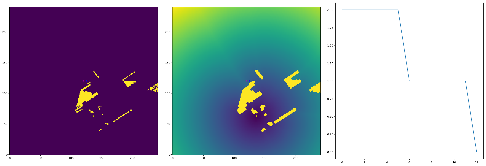
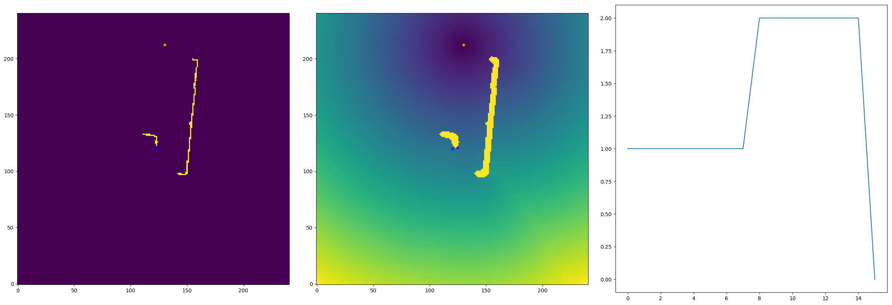
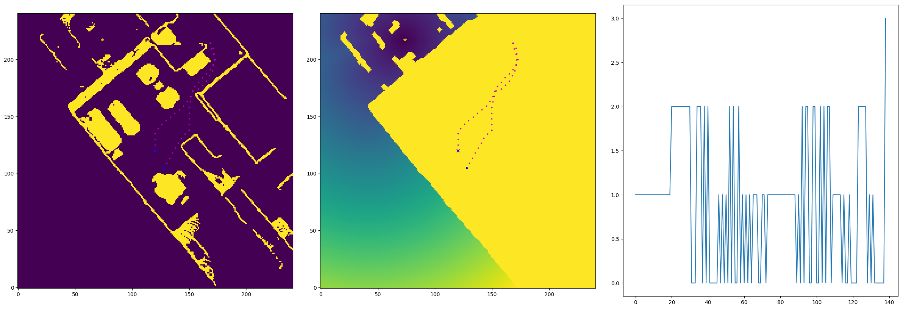

## Classical Mapping and Planning Baseline for Habitat Challenge
[Saurabh Gupta](http://saurabhg.web.illinois.edu/) \
Facebook AI Research

### Abstract
This baseline implements a basic *classical* map building and path planning algorithm for
the task of reaching a specified point under known odometry with depth images
as input. Depth images are back-projected to obtain a 3D point cloud. Points in
the 3D point cloud that lie within the robot height are projected on the 2D
plane to obtain an occupancy map. This occupancy map is dilated by the radius
of the robot to obtain a traversability map. Paths are planned on this
traversability map by computing the geodesic distance to the goal using
fast-marching method, and greedily picking actions that minimize this geodesic
distance. A very similar implementation was used as a baseline in
our past work on learning policy for this task in [[1](#references)], and as a
sub-routine for exploration in [[3](#references)].

### Method
This method comprises of three parts: [pose estimation](#pose-estimation) of
the location of the agent at successive steps, [map
construction](#map-construction) by stitching together successive depth maps
into an occupancy maps, and [path planning](#path-planning) to compute actions
to convey the agent to the desired target location.

##### Pose Estimation
Dynamics in Habitat are *almost everywhere* deterministic [[4](#references)].
Forward action always leads the agent to a location *25cm* in front of agent's
current location. Left action deterministically rotates the agent exactly by
*10 degree*. The only non-determinism in dynamics occurs when the agent
collides with an obstacle. Thus, if no collisions occur, dynamics are
completely deterministic. Even when a collision does occurs, the *goal-vector*
provided as input at every time step, can be used to recover the exact
motion [[5](#references)]. Thus, in our implementation, we initialize the agent
to be at the center of the map it is building, and maintain the agent's pose by
simply forward propagating these known dynamics. 

Use of these almost everywhere deterministic dynamics also collapse the third
unknown degree of freedom in the location of the goal, and the goal location
can be recovered in a consistent global frame fixed at the agent's starting
location. This makes the sensor suite *as strong as* the one used in our
own previous work [[1,2](#references)]. 

##### Map Construction
Depth images can be back-projected using the known camera matrix, to yield 3D
points in the world. Points from depth images at different time steps can be
brought into a common coordinate frame using the pose estimate for the robot at
every time step.

##### Path Planning
Given the built occupancy map, and the location of the goal in the coordinate
frame of the map, we employ classical path planning to output the action that
the agent should take. We compute the geodesic distance to the goal from all
locations on the map using fast-marching [[6](#references)]. We then simulate
action sequences: `F`, `LF`, `RF`, `LLF`, `RRF`, and so on, to compute which
one of them leads to the largest reduction in the geodesic distance. We then
pick the first action from the best action sequence. We developed this planner
for computing supervision for our paper on robust path following under noise
actuation and environmental changes [[7](#references)]. 

### Results
This basic implementation already achieves an SPL of *0.73* on the validation
set provided for the challenge. We visualized the error modes on the validation
set and made simple modifications to fix them. This boosted the SPL to *0.92*
on the validation set, and success rate to *0.976*. A number of these fixes
pertain to artifacts of the simulator. The two most significant conceptual
fixes were the following, other details can be found in the code:
1. Collision recovery behavior: Camera in habitat looks directly straight
ahead, and has a focal length of 90 degrees. This causes obstacles within the
immediate 1.25m in front of the object to not be visible, leading to collisions.
We detect such collisions (by using the goal vector at successive steps), and
implement a recovery behaviour (turn around and walk back 1.25m), and replan.
2. Our path planner as implemented in [[7](#references)], is not perfect and
occasionally thrashes (outputs an action sequence of `LRLRLR...`). We detect this
thrashing and instead of outputting a single action from the best sequence,
output the entire action sequence before replanning.

### Visualizations
We visualize built maps and executed paths for some sample success cases. We
then show current failure modes. Visualizations are from the Habitat Gibson
validation set. 
#### Successful Navigations
We show some top views of the maps that get built, and the trajectories that
the agent takes to achieve the goal. 


#### Current Error Modes
Of the 24 remaining unsolved episodes on the validation set, here are some
error modes. We show the first person RGB and depth image streams, top-view
obstacle map, top-view dilated obstacle map overlaid with geodesic distance to
goal, and the action sequence executed.
1. Getting stuck at corners. It is likely that this particular error is because of
a) the way missing parts of the mesh are treated in the simulator, or b) exact
thresholds used for determining obstacle or not. However, further investigation
is necessary. \
   \
   \
  
2. Building too small a map. We initialize a fixed size map based on how far
the goal is. It is possible that a detour that requires going out of the map is
required for solving the task. Starting with a large map, or adjusting the size
dynamically can fix this. \
  

### Usage
Version on the leaderboard is with the following agent invocation.
```
agent = DepthMapperAndPlanner(map_size_cm=1200, out_dir=None, mark_locs=True,
  reset_if_drift=True, count=-1, close_small_openings=True,
  recover_on_collision=True, fix_thrashing=True, goal_f=1.1, point_cnt=2)
```

### Citing
If you find this code useful please consider citing the following papers.
Mapping utilities are derived from code from the CVPR / IJCV paper, while the
planner is derived from code for our NeurIPS paper.
```
@inproceedings{gupta2017cognitive,
  author = "Gupta, Saurabh and Davidson, James and Levine, Sergey and Sukthankar, Rahul and Malik, Jitendra",
  title = "Cognitive mapping and planning for visual navigation",
  booktitle = "Proceedings of the IEEE Conference on Computer Vision and Pattern Recognition",
  year = "2017"
}

@inproceedings{kumar2018visual,
  author = "Kumar, Ashish and Gupta, Saurabh and Fouhey, David and Levine, Sergey and Malik, Jitendra",
  title = "Visual Memory for Robust Path Following",
  booktitle = "Advances in Neural Information Processing Systems",
  year = "2018"
}
```

### References
1. [Cognitive Mapping and Planning for Visual
Navigation](https://arxiv.org/pdf/1702.03920.pdf). IJCV (Accepted with Minor
Revisions) 2019. Saurabh Gupta, Varun Tolani James Davidson, Sergey Levine,
Rahul Sukthankar, and Jitendra Malik.
2. [Cognitive Mapping and Planning for Visual
Navigation](https://arxiv.org/pdf/1702.03920v2.pdf). CVPR 2017.  Saurabh Gupta,
James Davidson, Sergey Levine, Rahul Sukthankar, and Jitendra Malik.
3. [Learning Exploration Policies for
Navigation](https://arxiv.org/pdf/1903.01959.pdf). ICLR 2019. Tao Chen,
Saurabh Gupta, Abhinav Gupta.
4. [Habitat: A Platform for Embodied AI
Research](https://arxiv.org/abs/1904.01201). Manolis Savva, Abhishek Kadian,
Oleksandr Maksymets, Yili Zhao, Erik Wijmans, Bhavana Jain, Julian Straub, Jia
Liu, Vladlen Koltun, Jitendra Malik, Devi Parikh, Dhruv Batra. Tech report,
arXiv:1904.01201, 2019.
5. [[4](#references)] suggests motion is truncated on collision. For the point
goal task, it is possible to exactly determine the motion by using the change
in the goal-vector over time. [[4](#references)] also states that the agent can
*slide* along the wall. I haven't looked at the code to determine which of
these is the case.
6. [A Fast Marching Level Set Method for Monotonically Advancing
Fronts](https://math.berkeley.edu/~sethian/2006/Papers/sethian.fastmarching.pdf).
PNAS 1996. J.A. Sethian. 
7. [Visual Memory for Robust Path
Following](http://saurabhg.web.illinois.edu/pdfs/kumar2018visual.pdf). NeurIPS 2018. Ashish Kumar*, Saurabh Gupta*, David Fouhey, Sergey Levine, Jitendra
Malik.
